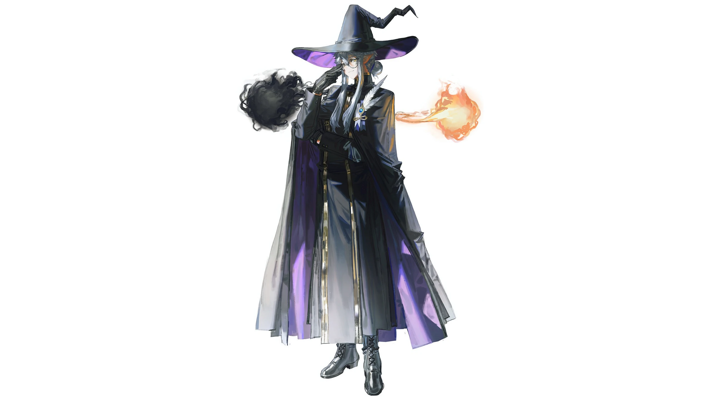

# 常无欲（baiqi / 降临者）

## 基础信息（以 characters.js / 选人界面为准）

| 项 | 值 |
|---|---|
| id | `baiqi` |
| 名字 | 常无欲 |
| 职业 | 降临者 |
| 主题色 | `#ad9ddd` |

## 外观锚点（已定稿，出图必须遵守）

2026-09-12 老板逐轮定稿并按立绘高清放大逐要素核对（出图脚本存档 `baiqi-cards-0912/manifest-sample.json`）。

- **男性**，优雅神秘气质，浅笑。
- **黑色弯尖魔女帽**（宽檐、紫色帽内衬）——不是普通宽檐帽。
- **圆框细边眼镜**（round eyeglasses）——立绘明确要素，出图必戴。
- **尖耳朵**（pointy ears）。
- 银灰色长发，脑后挽**低发髻**，两侧长发垂肩。
- **黄瞳**（2026-09-12 老板改定，原定红瞳作废；与立绘琥珀色眼接近，立绘无需更新）。
- 服装：**黑色高领长袍**（紫色内衬）、金色滚边、黑手套。
- 胸饰：**白色羽毛 + 蓝宝石金扣胸针**别在左肩/胸口（⚠️ 羽毛在胸口胸饰，不在帽子上）。
- 持**黑色法杖**（金纹杖头）。
- 画风：人设图/立绘质感（miv4t+quasarcake + limited palette + film grain），深紫→淡紫渐变氛围背景，人物紫边光保证脸部与金饰可读。
- 构图：横版 384:291 半身起步，主体大。

## 性格与背景（待老板提供）

- 性格：待老板提供。
- 背景故事：待老板提供。
- 与其他角色的关系：待老板提供。
- 口头禅 / 语言习惯：待老板提供。
