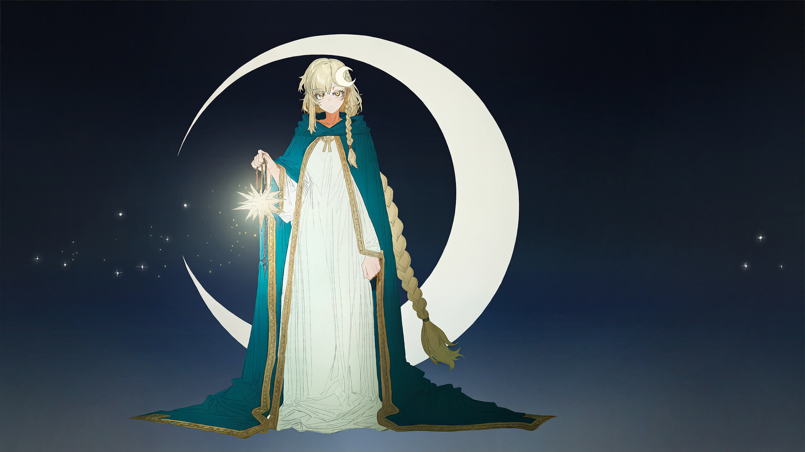

# 星月（dengkui / 牧师）

## 基础信息（以 characters.js / 选人界面为准）

| 项 | 值 |
|---|---|
| id | `dengkui` |
| 名字 | 星月（2026-09-12 由「灯葵」改名，id 与立绘文件名不变） |
| 职业 | 牧师 |
| 主题色 | `#81bcb0` |

## 外观锚点（已定稿，出图必须遵守）

2026-09-12 老板逐轮定稿并验收主立绘（赛璐璐色块风大图，`roster-main-0912-big/xingyue_seed1411148278.png`，已入库三组立绘）。

- **女性**，安静淡然气质，表情平静（expressionless），目视镜头。
- **淡金色超长发**，单侧编发汇入**低马尾**。
- **金瞳**。
- **白色神官风连衣裙 + 深青绿短披肩**（青绿=主题色 `#81bcb0` 落地）+ **金色滚边**。
- **月牙形发饰**（位置已文字钉死，2026-09-13 老板令）：**白色新月发夹，别在头顶刘海上方、偏她左侧（观众视角右侧）的发间，斜置、贴着头发**——不是悬浮光环、不在脑后、不在头顶正中立起。出图提示词必须带位置句，不能只写裸标签：
  `a white crescent moon hairpin clipped flat into the hair at the top of her head just above the bangs, slightly off-center to the viewer's right, tilted, resting against the hair (not floating, not a halo)`
- **右手提一盏发光的星灯**；身后背景画**巨大淡色月牙 + 星尘**。
- 画风：**赛璐璐色块**（cel shading + flat color），纯深藏青渐变底。
- 构图：全身居中、约占画幅高 85%、不出框；横版宽幅 16:9（4096×2304）。

## 2026-09-19 painterly 全身立绘定稿（老板授权 Friday 定锚点）

- 依据：`roster-painterly-four-v2-20260919-120257/dengkui-120257.png`（seed 1412045851），已实装 `portraits/full/dengkui.webp`。
- 演出：全身站姿，**右手提星灯平举身侧（灯光照亮裙摆）+ 左手胸前祈祷手势**；正脸三分钟视角、双眼金色可见（禁全侧面）。
- 月牙发饰沿用钉死句：观众视角**右侧**、贴发斜置（v1 曾出在左侧，v2 已修正）。
- 服装：白神官裙金滚边（层叠裙摆）+ 深青绿披肩金边；白袜短靴。
- 色调：**白 + 青绿 + 暖金**（主题色 `#81bcb0` 落地）；simple background 素底（旧版"背景大月牙+星尘"为历史口径，painterly 版不用）。
- 画风：painterly 统一画风模块（miv4t+quasarcake，`official_painterly_style.py`）。

## 性格与背景（待老板提供）

- 性格：立绘神态可参考「安静、淡然」，完整定稿文字待老板提供。
- 背景故事：待老板提供。
- 与其他角色的关系：待老板提供。
- 口头禅 / 语言习惯：待老板提供。
