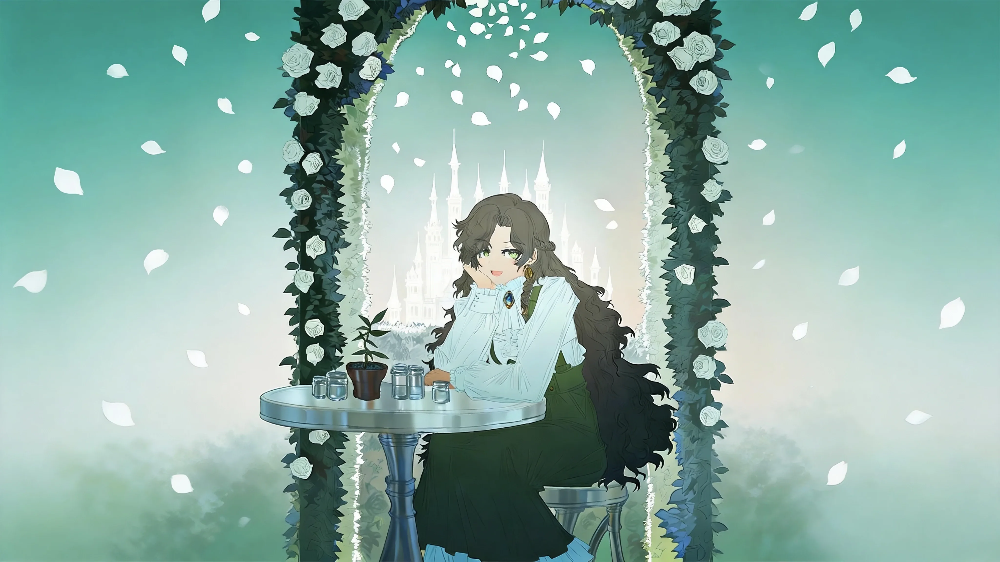

# 白塔（lituan / 法师）

## 基础信息（以 characters.js / 选人界面为准）

| 项 | 值 |
|---|---|
| id | `lituan` |
| 名字 | 白塔 |
| 职业 | 法师 |
| 主题色 | `#e9bd69` |

## 外观锚点（已定稿）

2026-09-19 老板授权 Friday 按 painterly 全身立绘定稿，当日二次修订（老板反馈）定稿：
依据 `roster-fix-20260919-170117/lituan-170117.png`（seed 1486003179），已实装 `portraits/full/lituan.webp`。

- **女性**，安静书卷气，表情平静温柔，目视镜头。
- **深棕色长卷发**，刘海别开不遮眼；**绿色眼瞳**（0919 二次修订：老板令参考原立绘定绿瞳，琥珀瞳作废）。
- **白色长袖衬衫**（收口袖扣）+ **深绿背带长裙**，白色短袜 + 黑色皮鞋。
- **坐姿演出（0919 二次修订）**：坐在雕花木椅上吃甜品——手托小盘蛋糕、持叉进食；**雕花古书放腿上**（金书签垂下，出图时需句子钉"古书保持在腿上"防被带飞）。
- **法师锚点（0919 方案 B 老板拍板）**：**椅子下地面一圈淡金魔法阵**（`magic circle`，金色符文沿环漂浮）+ **两三本打开的小书悬浮绕肩缓转**（`floating books`）——与腿上大书构成"书阵"，是白塔"法师"身份的主视觉证据。
- 肩侧另绕几粒**金色魔法光尘**；**暖金色为全身点缀色**（主题色 `#e9bd69` 落地）；simple background 素底。
- 构图：坐姿全身（含椅），三分钟视角正脸、双眼可见。
- 画风：painterly 统一画风模块（miv4t+quasarcake，`official_painterly_style.py`）。
- 旧立绘的花拱门白塔场景为历史版本口径，非现行立绘要素。

### 细粒度锚点（0919 定稿立绘逐要素，出图照抄）

依据 `roster-fix2-20260919-170853/lituan-170853-2202.png`（实装版）：

- **发型结构**：深棕近黑褐色**超长大波浪卷发**，坐姿下垂至椅侧/膝下（近地）；**厚刘海侧分、右侧用两枚金色长条金属夹别起**露出右眼；左侧卷发遮耳、垂落成卷丛。
- **脸**：翠绿瞳（清亮）；平静淡然；进食时嘴含叉。
- **服装层次**：白色长袖衬衫（小立领、门襟一排扣、**袖口双扣、袖蓬起收口**）；深绿背带长裙（**宽背带+正面金属搭扣**、裙摆及踝微层叠）。
- **道具形状**：**雕花古书平摊在腿上**——封面四角金属雕花包角、书脊纹章、**两条金色丝带书签垂下**；小银盘托**分层草莓顶蛋糕**；右手银叉入口、左手托盘。
- **椅子**：深色木质雕花扶手椅——卷涡纹扶手、雕花靠背、弯腿。
- **魔法元素位置**：**椅子下地面一圈淡金魔法阵**（外环符文圈+内环几何线）；**两三本打开的小书悬浮**（左肩上方一本、右上角一本，书页摊开微亮）；肩侧金色光尘数粒。
- **腿脚**：白短袜+**黑色横扣玛丽珍皮鞋**；双腿并拢斜放。
- **姿态**：坐姿正面三分视角，头微低看蛋糕、目视镜头。

## 性格与背景（待老板提供）

- 性格：待老板提供。
- 背景故事：待老板提供。
- 与其他角色的关系：待老板提供。
- 口头禅 / 语言习惯：待老板提供。
