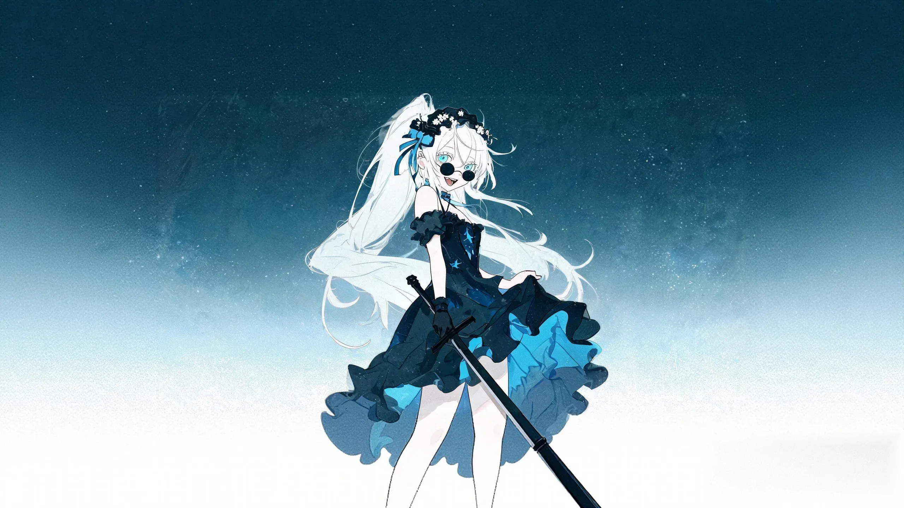

# 无（shuangling / 侠客）

## 基础信息（以 characters.js / 选人界面为准）

| 项 | 值 |
|---|---|
| id | `shuangling` |
| 名字 | 无 |
| 职业 | 侠客 |
| 主题色 | `#ed9b53` |
| 已定稿卡面 | `expedition-starters/wu-*.webp` 3 张能力卡 + 6 张人物卡（蓝眼/露眼刘海/墨镜/嚣张神态口径，2026-09 重绘定稿） |

## 外观锚点（已定稿，出图必须遵守）

来源：2026-09-12 交接文档定稿口径；同日老板逐项复核确认；同日老板增补**脸部特征须对齐定稿卡面**（出图"长得不像"是硬伤）。

**脸部（以三张定稿人物卡 wu-void / wu-myriadswords / wu-heavensword 为脸参考）**：
- 亮蓝色眼睛，眼型偏大微吊、眼神锐利带笑。
- **额前碎刘海、两眼完全可见**——⚠️ tag 禁用 `hair over one eye`（该词本义=遮住一只眼，曾导致出图遮眼被老板打回）；用 `parted bangs, eyebrows visible through hair`。
- 嘴微张嚣张笑、**露小虎牙**（`fang`）。
- 皮肤白皙、小圆脸少女感。
- 黑色圆框墨镜横架头顶（`black round sunglasses on head`），旁有黑蔷薇头饰与蓝丝带。

**整体**：
- 白色长发大波浪、**高马尾**，扎马尾用**丝带**（定稿色=蓝缎带）。
- **黑礼裙**（露肩哥特款、层叠荷叶边裙、蓝色星纹裙里衬）。
- **裸腿**——禁止裤袜/长袜。
- 神态**嚣张、自信**。
- 画风：**赛璐璐色块**（cel shading + flat color，2026-09-12 职业卡重做定调）。
- 共同参照首页壁纸与本页定稿立绘及三张定稿人物卡；**不要每张卡随机改变脸、眼色和发型**。
- 早期错误眼色的 `cards/wu-*.webp` 旧图已被映射绕开，切勿改回旧图。

## 2026-09-19 painterly 全身立绘定稿（老板逐项反馈修订）

- 依据：`roster-fix-20260919-170117/shuangling-170117.png`（seed 1769771149），已实装 `portraits/full/shuangling.webp`。
- **发型修订（0919 老板反馈）**：马尾收紧=**光滑束紧的高马尾**（`sleek smooth hair, tight neat high ponytail`），头发平贴不蓬松（禁 fluffy/voluminous/messy hair）——原「大波浪」口径按此收紧执行。
- **墨镜修订（0919 老板反馈）**：**哑光黑镜片、不反光无眩光**（`matte black`；UC 排 reflective sunglasses / lens flare / glasses reflection）。
- 演出：全身站姿叉腰，**黑色长剑斜背背后**（剑柄露肩上）+ 主句归属；裙摆 `high-low` 前短后长且**后摆止于小腿**（有效钉法=`the skirt in back stops at the shins`，`high-low skirt` tag 有拖地先验禁用）。
- 画风：painterly 统一画风模块（`official_painterly_style.py`）。

## 性格与背景（待老板提供）

- 性格：立绘神态可参考「嚣张、自信」，完整定稿文字待老板提供。
- 背景故事：待老板提供。
- 与其他角色的关系：待老板提供。
- 口头禅 / 语言习惯：待老板提供。
