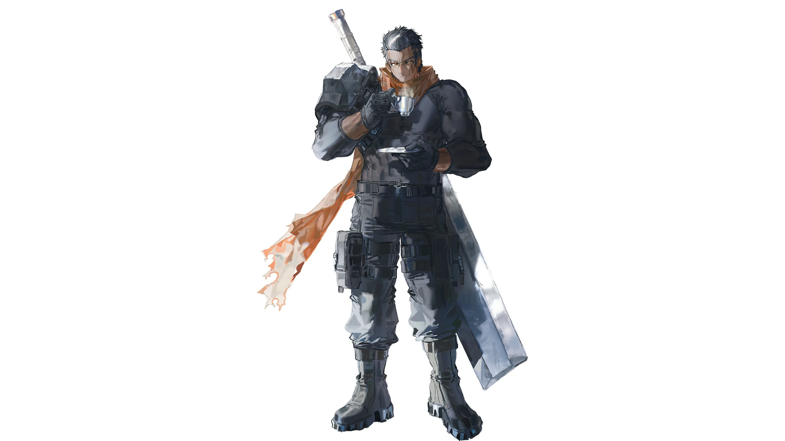

# 黑像（xuanli / 战士）

## 基础信息（以 characters.js / 选人界面为准）

| 项 | 值 |
|---|---|
| id | `xuanli` |
| 名字 | 黑像（2026-09-12 由「玄砾」改名，id 与立绘文件名不变） |
| 职业 | 战士 |
| 主题色 | `#d0805a` |

## 外观锚点（已定稿，出图必须遵守）

2026-09-12 老板逐轮定稿并验收主立绘（赛璐璐色块风大图，`roster-main-0912-big/heixiang_v3_seed645024971.png`，已入库三组立绘）。

- **男性**，**黑皮**（深肤色），高大壮硕：huge muscles / massive build / broad shoulders / thick arms。
- **黑色短发，背头露出额头**（2026-09-13 老板钉死）：发型必须写 `slicked back hair, exposed forehead`，且提示词带发型句 `His black hair is slicked back from his forehead, fully exposing it.`——只写裸标签 `black hair, short hair` 各卡会画出刘海/碎发导致脸不像（09-13 六卡翻车教训）。**金瞳**（amber eyes，露出不遮眼）。
- **脸颊缝线疤痕**（stitched scar）。
- 神态：**坏笑嚣张**（smirk），目视镜头——名字意象：像一尊黑色雕像般伫立，反差感是角色魅力核心。
- 服装：**黑色紧身长袖作战服 + 肩甲 + 黑手套黑裤黑靴**，**棕橙色围巾**（主题色 `#d0805a` 落地，全身唯一暖色点缀）。
- 武器：**巨型大剑**。
- 定稿主立绘演出：**纯白底**，单手捏小咖啡杯啜饮（小指微翘、托碟、热气），大剑插身侧——巨汉×小咖啡杯的反差感老板拍板定稿。
- 画风：**赛璐璐色块**（cel shading + flat color）。
- 构图：全身居中、约占画幅高 85%、不出框；横版宽幅 16:9（4096×2304）。

## 性格与背景（待老板提供）

- 性格：立绘神态可参考「坏笑、寡言、压迫感 + 反差萌」，完整定稿文字待老板提供。
- 背景故事：待老板提供。
- 与其他角色的关系：待老板提供。
- 口头禅 / 语言习惯：待老板提供。
